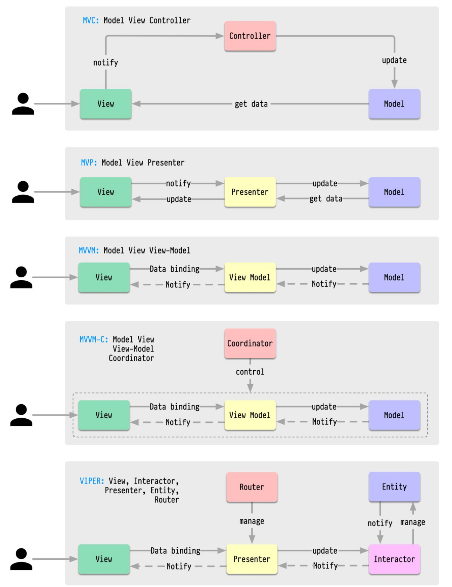
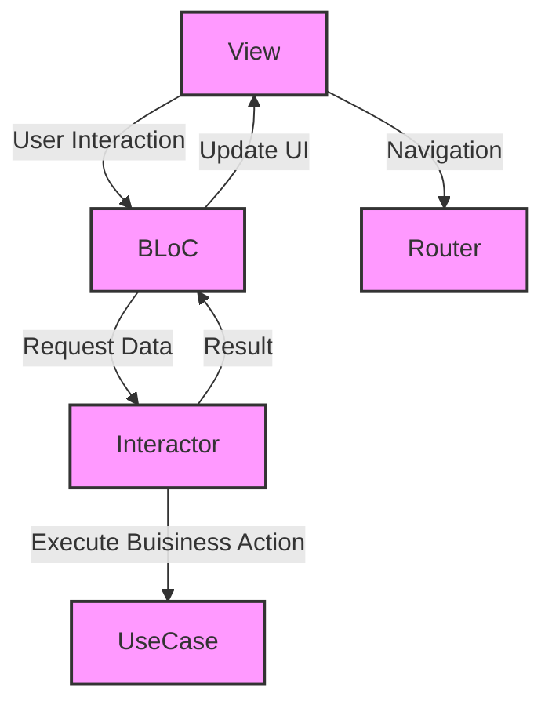
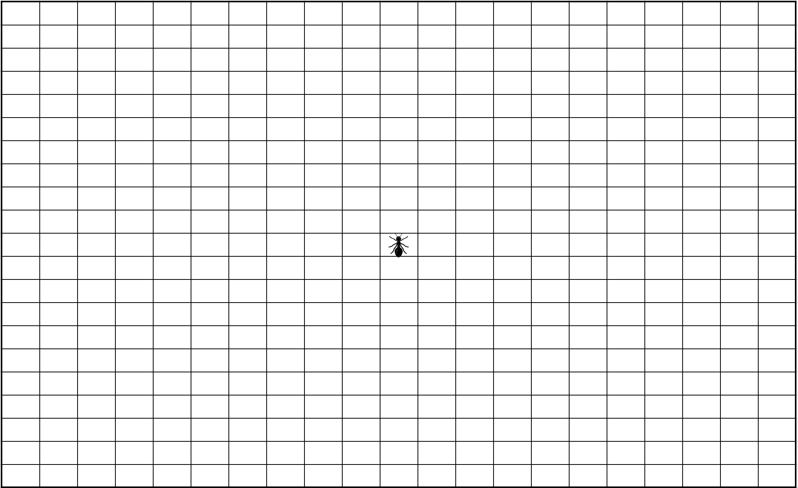

# Dojo : La Fourmi de Langton

## 1. Introduction

**Présentation de la Fourmi de Langton**

- **Histoire et Contexte :**

  La fourmi de Langton est un automate cellulaire bidimensionnel créé en 1986 par Christopher Langton, un chercheur américain pionnier dans le domaine de l’intelligence artificielle. Langton s’intéressait à la manière dont des règles simples pouvaient engendrer des comportements complexes, un concept central dans l’étude des systèmes dynamiques et de l’émergence.

  En concevant la fourmi de Langton, Langton cherchait à illustrer comment des interactions locales simples pouvaient conduire à des structures globales imprévisibles. L’automate suit des règles élémentaires : se déplaçant sur une grille de cases blanches et noires, la fourmi tourne à droite sur une case blanche, à gauche sur une case noire, change la couleur de la case, puis avance d’une case. Malgré cette simplicité, la fourmi adopte un comportement étonnamment complexe, passant d’une phase chaotique à la construction d’une “autoroute” régulière après environ 10 000 étapes.

  Cette création visait à démontrer que des systèmes aux règles de base rudimentaires pouvaient générer des comportements émergents sophistiqués, offrant ainsi un modèle pour comprendre des phénomènes similaires dans la nature et les systèmes artificiels. La fourmi de Langton est devenue un exemple emblématique de l’étude des automates cellulaires et de la vie artificielle, illustrant la manière dont la complexité peut émerger de la simplicité.

- **Les Règles de la Fourmi de Langton :**
    - La fourmi se déplace sur une grille de cellules blanches et noires.
    - Règle 1 : Si la fourmi est sur une cellule blanche, elle tourne à droite, change la cellule en noire et avance d'une case.
    - Règle 2 : Si la fourmi est sur une cellule noire, elle tourne à gauche, change la cellule en blanche et avance d'une case.


- **Impact :**

  Ce modèle est souvent utilisé pour étudier comment des systèmes simples peuvent générer des comportements émergents, offrant des insights précieux dans des domaines tels que la biologie, la sociologie et l’informatique. Il démontre que la complexité peut surgir de la simplicité, un principe fondamental dans l’étude des systèmes dynamiques et de l’émergence.

  L’émergence décrit le phénomène par lequel des interactions locales simples entre les composants d’un système conduisent à des structures ou des comportements globaux complexes, non prévus par les règles individuelles. La fourmi de Langton en est une illustration parfaite : des règles élémentaires de déplacement et de changement de couleur aboutissent à des motifs structurés et répétitifs après une phase de désordre apparent.
  Pour plus d’infos, je vous conseille l’excellente vidéo de Science Etonnante

[https://youtu.be/qZRYGxF6D3w?si=QpOdWIQfKzY9Ioal](https://youtu.be/qZRYGxF6D3w?si=QpOdWIQfKzY9Ioal)

**Objectifs du Dojo**

- **Behavior-Driven Development (BDD)**

  Le Behavior-Driven Development (BDD) est une approche de développement logiciel qui met l'accent sur la collaboration entre les développeurs, les testeurs et les experts métier. Il vise à améliorer la compréhension des besoins de l'utilisateur et à garantir que le logiciel développé répond réellement à ces besoins. Au cœur du BDD  se trouve l'idée que les spécifications doivent être écrites sous forme de scénarios comportementaux plutôt que  de tests techniques.

  **Les "3 Amigos" :**

  Le concept des "3 Amigos" trouve ses racines dans la volonté d'améliorer la communication et la compréhension des besoins au sein des équipes de développement. Historiquement, les silos entre les développeurs, les testeurs et les experts métier ont souvent conduit à des malentendus, des exigences mal interprétées et, finalement, à des logiciels qui ne répondent pas aux besoins réels des utilisateurs. Les "3 Amigos" cherchent à briser ces barrières en favorisant une collaboration étroite entre ces trois rôles clés.

  Le concept repose sur l'idée que chaque "Amigo" apporte une perspective unique au processus de développement:

  **Le Product Owner** (ou expert métier) apporte la vision du produit, les besoins de l'utilisateur et le contexte
  métier.

  **Le développeur** apporte son expertise technique, sa connaissance des possibilités et des contraintes
  technologiques.

  **Le testeur** se concentre sur la qualité, identifie les scénarios d'erreur potentiels et pense à la manière dont le
  logiciel sera validé.

  Lors d'une session "3 Amigos", l'équipe se réunit pour discuter d'une fonctionnalité ou d'une user story spécifique. L'objectif est de parvenir à une compréhension commune de ce qui doit être réalisé. C'est ici que l'**Example Mapping** entre en jeu.

  L'Example Mapping est une technique qui vise à transformer les discussions abstraites en exemples concrets. Plutôt que de parler en termes généraux ou théoriques, l'équipe se concentre sur des exemples réels ou réalistes pour illustrer comment une fonctionnalité donnée devrait fonctionner. Ces exemples servent de base pour définir des scénarios de test.

  La méthode se déroule généralement comme suit :

  i. **Exemples** : L'équipe commence par identifier des exemples concrets qui illustrent le comportement attendu de la fonctionnalité.

  ii. **Scénarios** : Ces exemples sont ensuite transformés en scénarios qui décrivent les étapes spécifiques à suivre et les résultats attendus.

  iii. **Règles** : En examinant ces scénarios, l'équipe peut déduire les règles métier sous-jacentes qui guident le comportement de la fonctionnalité.

  L'Example Mapping utilise des cartes de couleur pour représenter les différents éléments :

    - **User Stories** (en bleu)
    - **Règles métier** (en jaune)
    - **Exemples ou scénarios** (en vert)
    - **Questions ou incertitudes** (en rouge)

  L'Example Mapping, lorsqu'il est utilisé dans le cadre des "3 Amigos", permet d'assurer que toutes les parties prenantes ont une compréhension claire et partagée de la fonctionnalité à développer. Cela réduit les malentendus, facilite la planification des tests et garantit que le logiciel développé répond réellement aux besoins des utilisateurs.

  **Gherkin :**

  Gherkin est un langage de domaine spécifique (DSL) utilisé pour décrire les comportements sans définir comment ils sont mis en œuvre. Il utilise une syntaxe simple et naturelle qui peut être lue par des non-développeurs. Les principales constructions de Gherkin sont : Feature, Scenario, Given, When, Then, And, But, Scenario Outline et examples.

  https://www.wefiit.com/blog/rediger-en-gherkin

  https://cucumber.io/docs/gherkin/reference/

  Une fois maîtrisé, le BDD apporte son lot d’avantages :

  **Amélioration de la communication** : Le BDD favorise la collaboration et garantit que les développeurs, testeurs et experts métier ont une compréhension commune des exigences.

  **Documentation vivante** : Les scénarios Gherkin servent de documentation qui est toujours à jour.**Réduction des malentendus** : En définissant les comportements attendus, le BDD réduit les ambiguïtés et les malentendus.**Feedback rapide** : Les tests automatisés fournissent un retour rapide sur la qualité du code.

  **Mocks et Code Smells :**

  Les mocks sont des objets qui simulent le comportement d'objets réels de manière contrôlée. Bien que les mocks soient utiles, une utilisation excessive peut être considérée comme un "code smell". Selon Eric Elliott(6), une dépendance excessive aux mocks peut indiquer une conception inappropriée et rendre le code plus difficile à maintenir.

  **BDD et TDD :**

  Le BDD est souvent considéré comme une évolution du TDD. Tandis que le TDD se concentre sur le test des unités individuelles de code, le BDD élargit cette approche pour tester le comportement global du système. Le BDD met l'accent sur la vérification que le logiciel fait ce que l'utilisateur attend, tandis que le TDD se concentre sur la façon dont il le fait. Dans la pratique, le BDD et le TDD peuvent être utilisés conjointement : le BDD pour définir le comportement global et le TDD pour implémenter les détails techniques.

  En conclusion, le BDD est une approche puissante qui met l'accent sur la collaboration, la compréhension des besoins de l'utilisateur et la garantie que le logiciel développé répond réellement à ces besoins. Il peut être utilisé en complément ou en remplacement du TDD, selon les besoins du projet.

    - Se familiariser avec le pattern BLoC dans Flutter.
    - Apprendre à rédiger des tests automatisés avec Gherkin.
    - Développer une simulation visuelle de la fourmi de Langton avec une difficulté croissante.

  **BLoC et VIPER**




Différents patterns de présentation avec gestion d’état



## 2. Préparons la grille et notre fourmi

```gherkin
Feature: Fourmi de Langton

  Scenario: Conditions initiales
     When Je lance l'application
     Then J'ai une grille de {21} sur {21} cellules 
     And J'ai une fourmi aux coordonnées {10}, {10} orientée {"Nord"}
     And Je vois un widget {AppBar} avec le texte {"Langton Ant"}
     And Je vois un wuget {IconButton} avec l'icone {Icons.play_arrow_sharp}
```

## 3. Déplacements

Rappel : notre Fourmi de Langton se déplace selon ces 2 règles :

- Sur une case blanche, tourner à 90° à droite, inverser la couleur de la case, avancer d'une unité
- Sur une case noire, tourner à 90° à gauche, inverser la couleur de la case, avancer d'une unité

Veuillez implémenter ces règles lors du clic sur le bouton de lecture.

Pour illustrer, j'ai réalisé un exemple de cartographie pour 10 étapes (Vous pouvez l'utiliser pour faire vos tests unitaires) :

**Etat 0**


**Etat 1**


**Etat 2**


**Etat 3**


**Etat 4**


**Etat 5**


**Etat 6**


**Etat 7**


**Etat 8**


**Etat 9**


**Etat 10**

